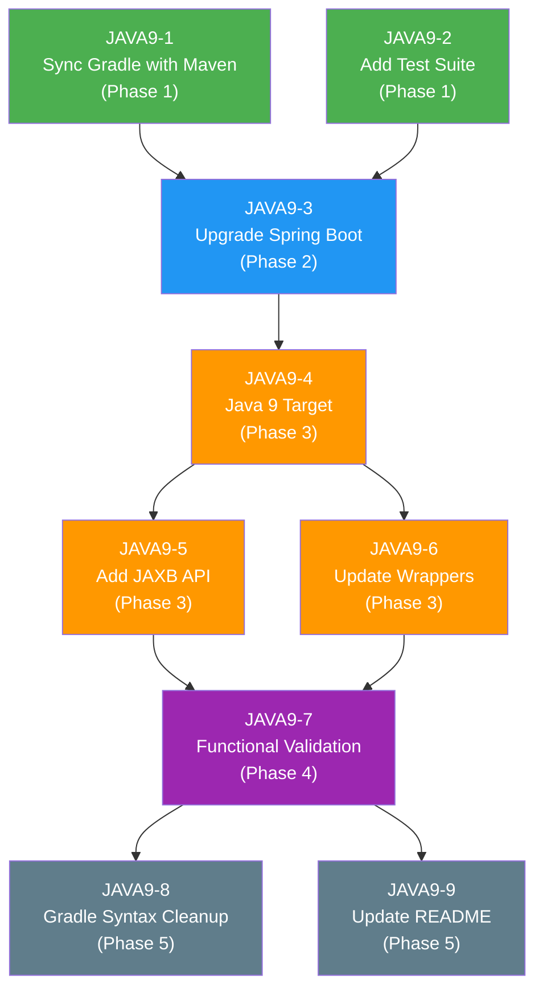

# Java 8 to Java 9 Migration Strategy

## Repository: COG-GTM/springboot-java8

**Date**: April 2026
**Current State**: Java 1.8, Spring Boot 2.0.2.RELEASE
**Target State**: Java 9, Spring Boot 2.1.18.RELEASE

---

## Table of Contents

1. [Executive Summary](#executive-summary)
2. [Current State Analysis](#current-state-analysis)
3. [Migration Strategy (5 Phases)](#migration-strategy-5-phases)
4. [Jira Ticket Definitions](#jira-ticket-definitions)
5. [Dependency Graph](#dependency-graph)
6. [Effort Summary](#effort-summary)
7. [Risk Assessment](#risk-assessment)

---

## Executive Summary

This document outlines the migration strategy for upgrading the `springboot-java8` repository from Java 8 to Java 9. The migration is **low-risk** — no source code changes are required since all Java 8 APIs used in the codebase (Streams, lambdas, NIO.2, `java.time`, functional interfaces, `JdbcTemplate`, `RestTemplate`) are fully forward-compatible with Java 9. The work is entirely in **build configuration**, **dependency management**, and **validation**.

The migration is structured into 5 phases across 9 Jira tickets, with an estimated total effort of **Low to Medium**.

---

## Current State Analysis

### Build Configuration

| Property              | Maven (`pom.xml`)          | Gradle (`build.gradle`)         |
|-----------------------|----------------------------|---------------------------------|
| Java version          | `1.8` (line 38)           | `1.8` (lines 25-26)            |
| Spring Boot version   | `2.0.2.RELEASE` (line 14) | `2.0.2.RELEASE` (line 6)       |
| Packaging             | `pom`                      | `jar` (via `bootJar`)          |

### Dependencies Comparison

| Dependency                              | Maven (`pom.xml` lines 17-35) | Gradle (`build.gradle` lines 28-31) |
|-----------------------------------------|:-----------------------------:|:------------------------------------:|
| `spring-boot-starter-web`              | Yes                            | Yes                                   |
| `spring-boot-starter-jdbc`             | Yes                            | **No** (out of sync)                 |
| `h2`                                   | Yes                            | **No** (out of sync)                 |
| `spring-boot-properties-migrator`      | Yes (runtime scope)            | **No** (out of sync)                 |
| `junit`                                | No                             | Yes (testCompile)                    |

> **Key Finding**: The Gradle build file is significantly out of sync with Maven. It is missing `spring-boot-starter-jdbc`, `h2`, and `spring-boot-properties-migrator` dependencies.

### Source Code (13 Java files under `src/main/java/hello/`)

| File | Java 8 Features Used |
|------|---------------------|
| `Application.java` | JdbcTemplate, RestTemplate, lambdas, Streams |
| `controller/GreetingController.java` | AtomicLong |
| `controller/HelloController.java` | - |
| `controller/TopicController.java` | Lambdas, Streams, NIO.2, java.time, Pattern |
| `declaration/CustomPredicate.java` | Functional interfaces |
| `declaration/TimeClient.java` | Default/static interface methods |
| `model/Customer.java` | POJO |
| `model/Greeting.java` | POJO |
| `model/Quote.java` | POJO |
| `model/SimpleTimeClient.java` | java.time API |
| `model/Topic.java` | POJO |
| `model/Value.java` | POJO |
| `service/TopicService.java` | Streams, lambdas, Optional |

### Test Suite

**No test suite exists.** There is no `src/test/` directory. This is a critical gap that must be addressed before migration.

### REST Endpoints (11 total)

| # | Method | Path | Controller |
|---|--------|------|------------|
| 1 | GET | `/` | `HelloController` |
| 2 | GET | `/topic` | `TopicController` |
| 3 | GET | `/topic/{id}` | `TopicController` |
| 4 | POST | `/topic` | `TopicController` |
| 5 | PUT | `/topic/{id}` | `TopicController` |
| 6 | DELETE | `/topic/{id}` | `TopicController` |
| 7 | GET | `/topic/minimum/length/{minLength}` | `TopicController` |
| 8 | GET | `/topic/sort` | `TopicController` |
| 9 | GET | `/topic/string/operation` | `TopicController` |
| 10 | GET | `/topic/file/operation` | `TopicController` |
| 11 | GET | `/datetime` | `TopicController` |

---

## Migration Strategy (5 Phases)

### Phase 1: Pre-Migration Preparation

**Objective**: Establish a reliable baseline before making any migration changes.

#### 1.1 Synchronize `build.gradle` with `pom.xml`

The Gradle build is currently out of sync with Maven. Add the missing dependencies to `build.gradle`:

```groovy
dependencies {
    compile("org.springframework.boot:spring-boot-starter-web")
    compile("org.springframework.boot:spring-boot-starter-jdbc")
    compile("com.h2database:h2")
    runtime("org.springframework.boot:spring-boot-properties-migrator")
    testCompile("junit:junit")
}
```

**Verification**: Both `./mvnw clean package` and `./gradlew build` should produce a runnable Spring Boot JAR.

#### 1.2 Add a Test Suite

Create a test suite under `src/test/java/hello/` to serve as a safety net during migration:

- **`ApplicationTests.java`**: Integration test verifying Spring Boot application context loads successfully.
- **`TopicServiceTest.java`**: Unit tests for `TopicService` covering CRUD operations, stream-based filtering, sorting, and Optional handling.
- **Endpoint smoke tests**: Controller tests for all 11 REST endpoints to verify HTTP status codes and basic response structure. Tests for:
  - `HelloControllerTest.java` — GET `/`
  - `TopicControllerTest.java` — All topic endpoints
  - `GreetingControllerTest.java` — Greeting endpoint

**Verification**: All tests pass on Java 8 with both Maven (`./mvnw test`) and Gradle (`./gradlew test`).

---

### Phase 2: Upgrade Spring Boot

**Objective**: Upgrade to a Spring Boot version that officially supports Java 9.

#### 2.1 Upgrade Spring Boot from 2.0.2.RELEASE to 2.1.18.RELEASE

Update in both build files:

- **`pom.xml`** line 14: Change `<version>2.0.2.RELEASE</version>` to `<version>2.1.18.RELEASE</version>`
- **`build.gradle`** line 6: Change `classpath("org.springframework.boot:spring-boot-gradle-plugin:2.0.2.RELEASE")` to `classpath("org.springframework.boot:spring-boot-gradle-plugin:2.1.18.RELEASE")`

**Why 2.1.18.RELEASE?** This is the last patch release of the 2.1.x line, which has full Java 9+ support and maintains backward compatibility with Java 8. It avoids the larger API changes in Spring Boot 2.2+.

#### 2.2 Remove `spring-boot-properties-migrator`

Remove the `spring-boot-properties-migrator` dependency from `pom.xml` (lines 18-22) and `build.gradle` (if added in Phase 1). This dependency was only needed for the Spring Boot 1.x to 2.x migration and is no longer required.

#### 2.3 Verify on Java 8

After the upgrade, verify that the application still compiles and runs correctly on Java 8:

- `./mvnw clean package` succeeds
- `./gradlew build` succeeds
- All tests from Phase 1 pass
- Application starts and all 11 endpoints respond correctly

---

### Phase 3: Java 9 Compilation Target

**Objective**: Update build configuration to target Java 9.

#### 3.1 Update Java Compilation Target

- **`pom.xml`** line 38: Change `<java.version>1.8</java.version>` to `<java.version>9</java.version>`
- **`build.gradle`** lines 25-26: Change to `sourceCompatibility = 9` and `targetCompatibility = 9`

#### 3.2 Add JAXB API Dependency

Java 9 modularizes the JDK and removes `javax.xml.bind` from the default classpath. Add the JAXB API dependency to prevent `ClassNotFoundException` at runtime:

**Maven (`pom.xml`)**:
```xml
<dependency>
    <groupId>javax.xml.bind</groupId>
    <artifactId>jaxb-api</artifactId>
    <version>2.3.0</version>
</dependency>
```

**Gradle (`build.gradle`)**:
```groovy
compile("javax.xml.bind:jaxb-api:2.3.0")
```

#### 3.3 Update Build Tool Wrappers

Ensure the Maven and Gradle wrappers support Java 9:

- **Maven wrapper**: Update to Maven 3.5.0+ (required for Java 9 support)
- **Gradle wrapper**: Update to Gradle 4.2.1+ (first version with Java 9 support)

Update commands:
```bash
# Maven - update .mvn/wrapper/maven-wrapper.properties
# Set distributionUrl to Maven 3.5.4+

# Gradle
./gradlew wrapper --gradle-version 4.2.1
```

---

### Phase 4: Validation & Smoke Testing

**Objective**: Comprehensive validation that the application works correctly on Java 9.

#### 4.1 Build Verification

Build with both Maven and Gradle on JDK 9:
```bash
./mvnw clean package
./gradlew clean build
```

Both must succeed with zero errors.

#### 4.2 Endpoint Testing

Test all 11 REST endpoints manually or via automated tests:

| # | Endpoint | Expected Behavior |
|---|----------|-------------------|
| 1 | `GET /` | Returns greeting message |
| 2 | `GET /topic` | Returns list of all topics |
| 3 | `GET /topic/{id}` | Returns topic by ID |
| 4 | `POST /topic` | Creates a new topic |
| 5 | `PUT /topic/{id}` | Updates an existing topic |
| 6 | `DELETE /topic/{id}` | Deletes a topic |
| 7 | `GET /topic/minimum/length/{minLength}` | Filters topics by ID length (Streams) |
| 8 | `GET /topic/sort` | Returns sorted topics (Streams) |
| 9 | `GET /topic/string/operation` | String operations on topics |
| 10 | `GET /topic/file/operation` | NIO.2 file operations |
| 11 | `GET /datetime` | java.time API demonstration |

#### 4.3 JDBC/H2 Verification

Verify the JDBC startup logic in `Application.run()` (`src/main/java/hello/Application.java` lines 63-86):
- H2 in-memory database initializes correctly
- `Customer` table is created and populated
- Query results are logged correctly

#### 4.4 RestTemplate External API Call

Verify the RestTemplate call in `Application.java` (lines 38-40) that fetches a quote from `https://gturnquist-quoters.cfapps.io/api/random`.

> **Note**: This external endpoint may be defunct. If it fails, document the failure and consider removing or mocking the call. This is a pre-existing issue unrelated to the Java 9 migration.

#### 4.5 Reflective Access Warnings

Java 9 introduces warnings for illegal reflective access. During testing, monitor for warnings like:
```
WARNING: An illegal reflective access operation has occurred
```

If present, they can be suppressed by adding JVM arguments:
```
--add-opens java.base/java.lang=ALL-UNNAMED
```

Add to build configuration if necessary:
- **Maven**: `<argLine>` in `maven-surefire-plugin`
- **Gradle**: `jvmArgs` in test task configuration

---

### Phase 5: Documentation & Cleanup

**Objective**: Finalize the migration with documentation updates and build cleanup.

#### 5.1 Update `README.md`

- Update Java version reference from Java 8 to Java 9
- Update Spring Boot version reference to 2.1.18.RELEASE
- Add Java 9 to the prerequisites section
- Note any deprecated external API endpoints

#### 5.2 Replace Deprecated Gradle Syntax

Update `build.gradle` to replace deprecated dependency configurations:

| Deprecated | Replacement |
|-----------|-------------|
| `compile` | `implementation` |
| `testCompile` | `testImplementation` |
| `runtime` | `runtimeOnly` |

Example updated dependencies block:
```groovy
dependencies {
    implementation("org.springframework.boot:spring-boot-starter-web")
    implementation("org.springframework.boot:spring-boot-starter-jdbc")
    implementation("com.h2database:h2")
    implementation("javax.xml.bind:jaxb-api:2.3.0")
    testImplementation("junit:junit")
}
```

---

## Jira Ticket Definitions

### JAVA9-1: Synchronize Gradle Build with Maven Dependencies

| Field | Value |
|-------|-------|
| **Type** | Task |
| **Priority** | High |
| **Phase** | Phase 1: Pre-Migration Preparation |
| **Dependencies** | None |
| **Story Points** | 2 |

**Description**:
The `build.gradle` file is missing several dependencies that are present in `pom.xml`. This causes the Gradle build to potentially behave differently from Maven. Synchronize the Gradle dependencies to match Maven before proceeding with migration.

**Affected Files**:
- `build.gradle` (add missing dependencies)
- `pom.xml` (reference only, no changes)

**Acceptance Criteria**:
- [ ] `build.gradle` includes `spring-boot-starter-jdbc` dependency
- [ ] `build.gradle` includes `h2` dependency
- [ ] `build.gradle` includes `spring-boot-properties-migrator` (runtime scope)
- [ ] `./gradlew build` succeeds
- [ ] `./gradlew bootRun` starts the application successfully
- [ ] Application behavior is identical between Maven and Gradle builds

---

### JAVA9-2: Add Test Suite for Pre-Migration Safety Net

| Field | Value |
|-------|-------|
| **Type** | Task |
| **Priority** | High |
| **Phase** | Phase 1: Pre-Migration Preparation |
| **Dependencies** | None |
| **Story Points** | 5 |

**Description**:
There is currently no test suite (`src/test/` does not exist). Create a comprehensive test suite to serve as a regression safety net during the migration. Tests must pass on Java 8 before any migration changes are made.

**Affected Files** (new files):
- `src/test/java/hello/ApplicationTests.java`
- `src/test/java/hello/service/TopicServiceTest.java`
- `src/test/java/hello/controller/HelloControllerTest.java`
- `src/test/java/hello/controller/TopicControllerTest.java`
- `src/test/java/hello/controller/GreetingControllerTest.java`

**Acceptance Criteria**:
- [ ] Integration test verifying `ApplicationContext` loads successfully
- [ ] Unit tests for `TopicService` covering: `getAllTopics()`, `getTopic(id)`, `addTopic()`, `updateTopic()`, `deleteTopic()`, stream-based filtering, sorting, and `Optional` handling
- [ ] Endpoint smoke tests for all 11 REST endpoints verifying HTTP status codes and basic response bodies
- [ ] All tests pass with `./mvnw test` on Java 8
- [ ] All tests pass with `./gradlew test` on Java 8
- [ ] Test coverage includes both happy path and basic error cases

---

### JAVA9-3: Upgrade Spring Boot from 2.0.2 to 2.1.18

| Field | Value |
|-------|-------|
| **Type** | Task |
| **Priority** | High |
| **Phase** | Phase 2: Upgrade Spring Boot |
| **Dependencies** | JAVA9-1, JAVA9-2 |
| **Story Points** | 2 |

**Description**:
Upgrade Spring Boot from 2.0.2.RELEASE to 2.1.18.RELEASE in both Maven and Gradle build files. This version has full Java 9 support while maintaining Java 8 backward compatibility. Also remove the `spring-boot-properties-migrator` dependency which is no longer needed (it was for the 1.x to 2.x migration).

**Affected Files**:
- `pom.xml` (line 14: update version; lines 18-22: remove properties-migrator)
- `build.gradle` (line 6: update plugin version; remove properties-migrator if added in JAVA9-1)

**Acceptance Criteria**:
- [ ] Spring Boot version is `2.1.18.RELEASE` in both `pom.xml` and `build.gradle`
- [ ] `spring-boot-properties-migrator` dependency is removed from both build files
- [ ] `./mvnw clean package` succeeds on Java 8
- [ ] `./gradlew clean build` succeeds on Java 8
- [ ] All tests from JAVA9-2 pass
- [ ] Application starts and all 11 endpoints respond correctly

---

### JAVA9-4: Update Java Compilation Target to Java 9

| Field | Value |
|-------|-------|
| **Type** | Task |
| **Priority** | High |
| **Phase** | Phase 3: Java 9 Compilation Target |
| **Dependencies** | JAVA9-3 |
| **Story Points** | 1 |

**Description**:
Update the Java compilation target from 1.8 to 9 in both build files. This is the core migration change.

**Affected Files**:
- `pom.xml` (line 38: change `<java.version>1.8</java.version>` to `<java.version>9</java.version>`)
- `build.gradle` (lines 25-26: change `sourceCompatibility = 1.8` / `targetCompatibility = 1.8` to `9`)

**Acceptance Criteria**:
- [ ] `pom.xml` specifies `<java.version>9</java.version>`
- [ ] `build.gradle` specifies `sourceCompatibility = 9` and `targetCompatibility = 9`
- [ ] `./mvnw clean compile` succeeds on JDK 9
- [ ] `./gradlew compileJava` succeeds on JDK 9

---

### JAVA9-5: Add JAXB API Dependency for Java 9 Compatibility

| Field | Value |
|-------|-------|
| **Type** | Task |
| **Priority** | Medium |
| **Phase** | Phase 3: Java 9 Compilation Target |
| **Dependencies** | JAVA9-4 |
| **Story Points** | 1 |

**Description**:
Java 9 modularizes the JDK and removes `javax.xml.bind` from the default classpath. Spring Boot and some of its transitive dependencies may require JAXB at runtime. Add `javax.xml.bind:jaxb-api:2.3.0` to both build files to prevent `ClassNotFoundException`.

**Affected Files**:
- `pom.xml` (add JAXB API dependency)
- `build.gradle` (add JAXB API dependency)

**Acceptance Criteria**:
- [ ] `javax.xml.bind:jaxb-api:2.3.0` is present in both `pom.xml` and `build.gradle`
- [ ] No `ClassNotFoundException` related to `javax.xml.bind` at runtime
- [ ] Application starts successfully on JDK 9
- [ ] All tests pass on JDK 9

---

### JAVA9-6: Update Maven and Gradle Wrapper Versions

| Field | Value |
|-------|-------|
| **Type** | Task |
| **Priority** | Medium |
| **Phase** | Phase 3: Java 9 Compilation Target |
| **Dependencies** | JAVA9-4 |
| **Story Points** | 1 |

**Description**:
Update the Maven and Gradle wrappers to versions that support Java 9. Maven requires 3.5.0+ and Gradle requires 4.2.1+ for Java 9 compatibility.

**Affected Files**:
- `mvnw` (Maven wrapper script)
- `mvnw.cmd` (Maven wrapper script for Windows)
- `.mvn/wrapper/maven-wrapper.properties` (distribution URL)
- `.mvn/wrapper/maven-wrapper.jar` (wrapper JAR)
- `gradlew` (Gradle wrapper script)
- `gradlew.bat` (Gradle wrapper script for Windows)
- `gradle/wrapper/gradle-wrapper.properties` (distribution URL)
- `gradle/wrapper/gradle-wrapper.jar` (wrapper JAR)

**Acceptance Criteria**:
- [ ] Maven wrapper points to Maven 3.5.4 or later
- [ ] Gradle wrapper points to Gradle 4.2.1 or later
- [ ] `./mvnw --version` reports Maven 3.5.4+
- [ ] `./gradlew --version` reports Gradle 4.2.1+
- [ ] Both wrappers work correctly on JDK 9

---

### JAVA9-7: Functional Validation of All Endpoints on Java 9

| Field | Value |
|-------|-------|
| **Type** | Task |
| **Priority** | High |
| **Phase** | Phase 4: Validation & Smoke Testing |
| **Dependencies** | JAVA9-4, JAVA9-5, JAVA9-6 |
| **Story Points** | 3 |

**Description**:
Perform comprehensive functional validation of the entire application running on JDK 9. This includes all 11 REST endpoints, JDBC/H2 database initialization, the external RestTemplate API call, and monitoring for illegal reflective access warnings.

**Affected Files** (potentially):
- `pom.xml` (if JVM args needed for reflective access warnings)
- `build.gradle` (if JVM args needed for reflective access warnings)

**Acceptance Criteria**:
- [ ] Application starts on JDK 9 without errors
- [ ] All 11 REST endpoints return expected responses:
  - `GET /` — greeting message
  - `GET /topic` — list of topics
  - `GET /topic/{id}` — single topic
  - `POST /topic` — creates topic
  - `PUT /topic/{id}` — updates topic
  - `DELETE /topic/{id}` — deletes topic
  - `GET /topic/minimum/length/{minLength}` — filtered list
  - `GET /topic/sort` — sorted list
  - `GET /topic/string/operation` — string operation results
  - `GET /topic/file/operation` — file operation results
  - `GET /datetime` — date/time results
- [ ] H2 database initializes and `Customer` table is populated (verified via logs)
- [ ] RestTemplate external call is tested (document if defunct)
- [ ] Illegal reflective access warnings are documented and addressed (suppressed via JVM args if needed)
- [ ] All tests from JAVA9-2 pass on JDK 9

---

### JAVA9-8: Update Deprecated Gradle Syntax

| Field | Value |
|-------|-------|
| **Type** | Task |
| **Priority** | Low |
| **Phase** | Phase 5: Documentation & Cleanup |
| **Dependencies** | JAVA9-7 |
| **Story Points** | 1 |

**Description**:
Replace deprecated Gradle dependency configurations with their modern equivalents. The `compile`, `testCompile`, and `runtime` configurations were deprecated in Gradle 4.x in favor of `implementation`, `testImplementation`, and `runtimeOnly`.

**Affected Files**:
- `build.gradle` (update dependency configuration names)

**Acceptance Criteria**:
- [ ] All `compile` configurations replaced with `implementation`
- [ ] All `testCompile` configurations replaced with `testImplementation`
- [ ] All `runtime` configurations replaced with `runtimeOnly`
- [ ] `./gradlew clean build` succeeds with no deprecation warnings related to configurations
- [ ] All tests pass

---

### JAVA9-9: Update README and Project Documentation

| Field | Value |
|-------|-------|
| **Type** | Task |
| **Priority** | Low |
| **Phase** | Phase 5: Documentation & Cleanup |
| **Dependencies** | JAVA9-7 |
| **Story Points** | 1 |

**Description**:
Update the project README and any other documentation to reflect the completed migration from Java 8 to Java 9 and Spring Boot 2.0.2 to 2.1.18.

**Affected Files**:
- `README.md`

**Acceptance Criteria**:
- [ ] README references Java 9 (not Java 8) as the required Java version
- [ ] README references Spring Boot 2.1.18.RELEASE
- [ ] Prerequisites section updated to specify JDK 9+
- [ ] Any defunct external API endpoints are documented with a note
- [ ] Migration notes section added describing what changed and why

---

## Dependency Graph



**Legend**:
- Green (Phase 1): Pre-Migration Preparation
- Blue (Phase 2): Spring Boot Upgrade
- Orange (Phase 3): Java 9 Compilation Target
- Purple (Phase 4): Validation & Smoke Testing
- Gray (Phase 5): Documentation & Cleanup

**Parallelization Opportunities**:
- JAVA9-1 and JAVA9-2 can be executed in parallel (no interdependencies)
- JAVA9-5 and JAVA9-6 can be executed in parallel (both depend only on JAVA9-4)
- JAVA9-8 and JAVA9-9 can be executed in parallel (both depend only on JAVA9-7)

---

## Effort Summary

| Phase | Description | Tickets | Effort | Story Points |
|-------|-------------|---------|--------|--------------|
| **Phase 1** | Pre-Migration Preparation | JAVA9-1, JAVA9-2 | **Medium** | 7 |
| **Phase 2** | Spring Boot Upgrade | JAVA9-3 | **Low** | 2 |
| **Phase 3** | Java 9 Compilation Target | JAVA9-4, JAVA9-5, JAVA9-6 | **Low** | 3 |
| **Phase 4** | Validation & Smoke Testing | JAVA9-7 | **Medium** | 3 |
| **Phase 5** | Documentation & Cleanup | JAVA9-8, JAVA9-9 | **Low** | 2 |
| | **Total** | **9 tickets** | **Low-Medium** | **17** |

### Effort Notes

- **Phase 1 is the largest effort** due to the need to create a test suite from scratch (JAVA9-2). This is the bulk of the work.
- **Phase 2 is straightforward** — a version bump in two files and dependency removal.
- **Phase 3 is mechanical** — changing version numbers and adding a single dependency.
- **Phase 4 requires manual validation** but is well-defined with clear pass/fail criteria.
- **Phase 5 is minor cleanup** that can be done quickly.

---

## Risk Assessment

| Risk | Likelihood | Impact | Mitigation |
|------|-----------|--------|------------|
| Source code incompatibility with Java 9 | **Very Low** | Medium | All Java 8 APIs used are forward-compatible. No code changes needed. |
| Spring Boot 2.1.x breaking changes | **Low** | Medium | 2.1.x is backward-compatible with 2.0.x for the features used in this project. |
| JAXB `ClassNotFoundException` on Java 9 | **Medium** | Low | Addressed in JAVA9-5 by adding explicit JAXB API dependency. |
| Illegal reflective access warnings | **High** | **Very Low** | Warnings only — no functional impact. Can be suppressed with JVM args. |
| External API (`gturnquist-quoters`) failure | **High** | **Very Low** | Pre-existing issue unrelated to migration. Document and consider removing. |
| Gradle/Maven wrapper incompatibility | **Low** | Low | Addressed in JAVA9-6 by updating to compatible versions. |

### Overall Assessment

**This is a low-risk migration.** No source code changes are needed — the work is entirely in build configuration, dependency management, and validation. The phased approach with a test safety net (Phase 1) further reduces risk by catching any regressions early.

### Critical Path

The critical path through the dependency graph is:

```
JAVA9-2 (5 SP) → JAVA9-3 (2 SP) → JAVA9-4 (1 SP) → JAVA9-5 (1 SP) → JAVA9-7 (3 SP)
```

Total critical path: **12 story points**. JAVA9-2 (test suite creation) is the bottleneck.
