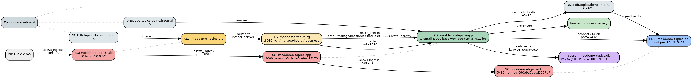
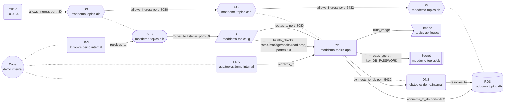

# Application dependency graph

Discovered agentlessly from AWS APIs in `us-east-1` for `Project=modernization-demo`, `Track=java` (14 nodes, 19 edges). Regenerate with `make aws-discover`.

## Edges

| from | edge | to | attrs |
|---|---|---|---|
| `sg:moddemo-topics-alb` | allows_ingress | `sg:moddemo-topics-app` | {"port": 8080, "protocol": "tcp"} |
| `cidr:0.0.0.0/0` | allows_ingress | `sg:moddemo-topics-alb` | {"port": 80, "protocol": "tcp"} |
| `sg:moddemo-topics-app` | allows_ingress | `sg:moddemo-topics-db` | {"port": 5432, "protocol": "tcp"} |
| `ec2:moddemo-topics-app` | runs_image | `image:topics-api:legacy` | {"base_image": "eclipse-temurin:11-jre"} |
| `alb:moddemo-topics-alb` | routes_to | `tg:moddemo-topics-tg` | {"listener_port": 80, "protocol": "HTTP"} |
| `tg:moddemo-topics-tg` | routes_to | `ec2:moddemo-topics-app` | {"port": 8080} |
| `tg:moddemo-topics-tg` | health_checks | `ec2:moddemo-topics-app` | {"path": "/manage/health/readiness", "port": 8080, "state": "healthy"} |
| `ec2:moddemo-topics-app` | reads_secret | `secret:moddemo-topics/db` | {"key": "DB_PASSWORD"} |
| `dns:app.topics.demo.internal` | resolves_to | `ec2:moddemo-topics-app` | {} |
| `dns:db.topics.demo.internal` | resolves_to | `rds:moddemo-topics-db` | {} |
| `dns:lb.topics.demo.internal` | resolves_to | `alb:moddemo-topics-alb` | {} |
| `ec2:moddemo-topics-app` | connects_to_db | `dns:db.topics.demo.internal` | {"host": "db.topics.demo.internal", "port": 5432} |
| `ec2:moddemo-topics-app` | connects_to_db | `rds:moddemo-topics-db` | {"via": "db.topics.demo.internal", "port": 5432} |
